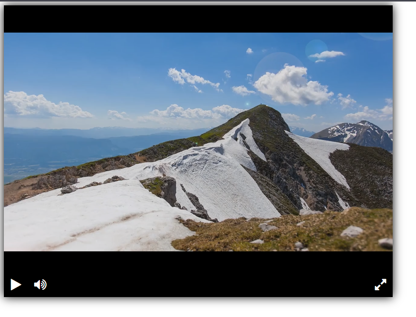

# Видеоплеер

Видеоплеер построен с использованием библиотеки [Playable](https://wix.github.io/playable/). 

Добавлен дизайн для кнопок.

Пример прототипа плеера опубликован на GitHub Pages по ссылке:
[https://tashako12.github.io/](https://tashako12.github.io/)

## Установка

Скачайте код: 
```
git clone https://github.com/TashaKo12/video_player.git
```

## Запуск

В репозитории представлен файл `index.html`, который можно запустить двойным кликом.
В браузере вы должны получить следующий результат:



## Цель

Это урок в курсе по программированию от [devman](https://dvmn.org).
